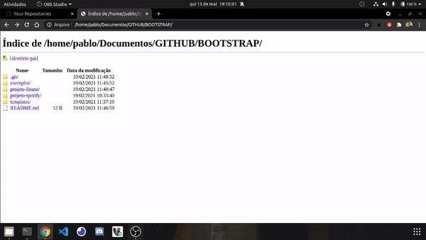

<h1 align="center"> bootstrap</h1>
<h3 align="center">Repositório destinado ao estudo do framework bootstrap</h3>

<h4>Este repositório contém:</h4>

- Exemplos das funcionalidades do bootstrap
- Templates do starbootstrap
- projeto de reformulação do spotify
- projeto finans com as classes do bootstrap
